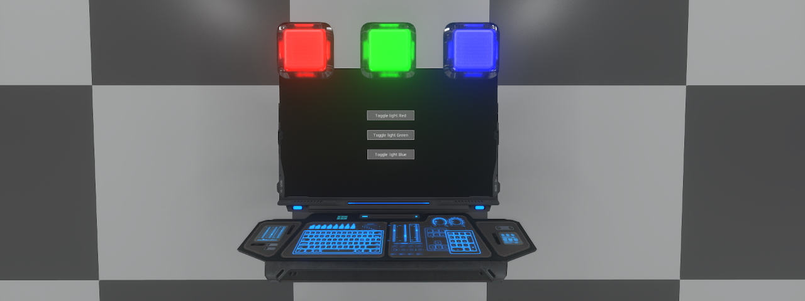

# Lua Screen Light Control
## Slider widgets

### Description
- This example shows you a use of an interface widget developed in the previous example in [Lua Screen Widgets Objects](https://github.com/dual-universe/lua-examples/tree/main/examples/03%20-%20Lua%20Screen%20Widgets%20Objects) example. In this case, it will show you one of the many ways to interact with screen elements using toggle buttons.
### Requirements
- You will need:
  - A programming board
  - A screen unit
  - 3 lights (Square XS in the visual but do as you wish)
### Installation
- Firstly, for the screen unit part:
  - Place the screen unit.
  - Copy and paste the [render.lua](render.lua) into the screen content in Lua mode.
- Then, for the programming board
  - Place the programming board.
  - Create a start filter in the unit slot.
  - Copy the content of [unit_start.lua](unit_start.lua) code.
  - Create a tick filter in the unit slot. Set the timerId as `output`.
  - Copy the content of [unit_tick1.lua](unit_tick1.lua) code.
- Finaly link the three lights to the programming board and name the slots in the Lua editor of the programming board as `lightRed`, `lightGreen` and `lightBlue`.
