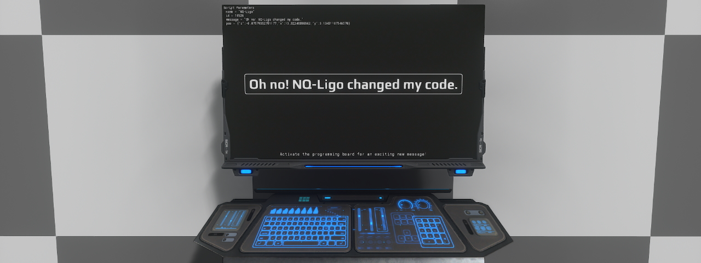

# Lua Screen Interaction
These examples are intended to show you how to do interactions between screens and other elements.

## Random screen message

### Description
- This example shows you another way of interacting between a screen unit and other elements. But this time we will do the opposite of the previous example [Lua Screen Light Control](https://github.com/dual-universe/lua-examples/tree/main/examples/04%20-%20Lua%20Screen%20Light%20Control). To be clear, in this case we are going to show you how to interact between the programming board and the screen by sending it a message and the player username.

### Requirements
- You will need:
  - A programming board
  - A screen unit
### Installation
- Firstly, for the screen unit part:
  - Place the screen unit.
  - Copy and paste the [render.lua](render.lua) into the screen content in Lua mode.
- Place the programming board.
- Then, link the screen to the programming board with the link tool.
- Finaly, paste the [controlunit.json](controlunit.json) file on your programming board with contextual menu, OR proceed manualy as below:
  - Edit the Lua content of the programming board
  - Name the screen slot in the Lua editor of the programming board as `screen`.
  - Create an onStart filter in the unit slot.
  - Paste the content of [unit_onStart.lua](unit_onStart.lua) code in.
  - Create an onMouseDown filter in the screen slot. Set the x and y arguments as `*` and `*` (whitecard on filters).
  - Paste the content of [screen_onMouseDown.lua](screen_onMouseDown.lua) code.

